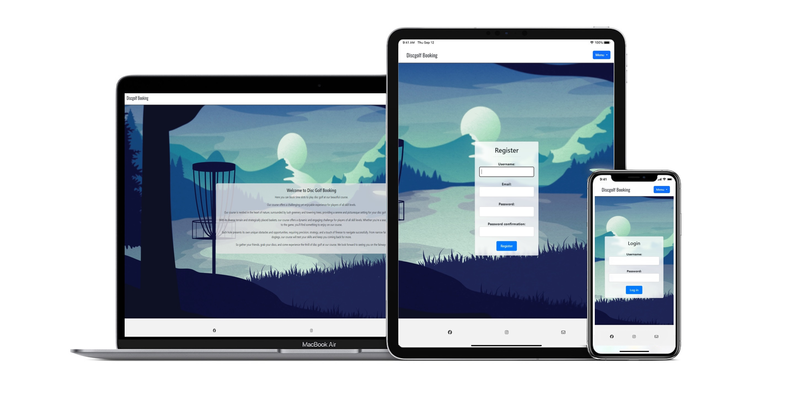
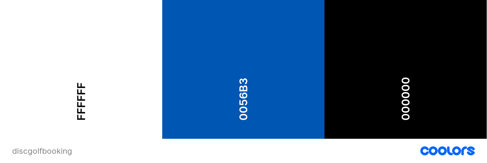
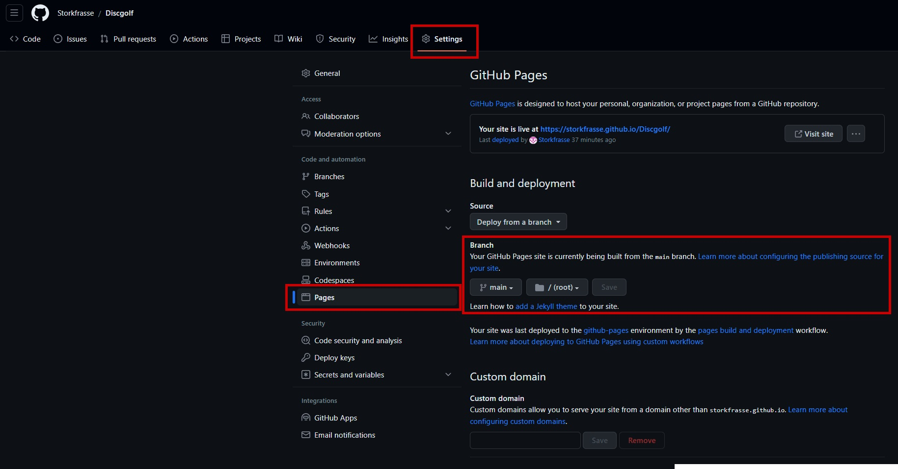
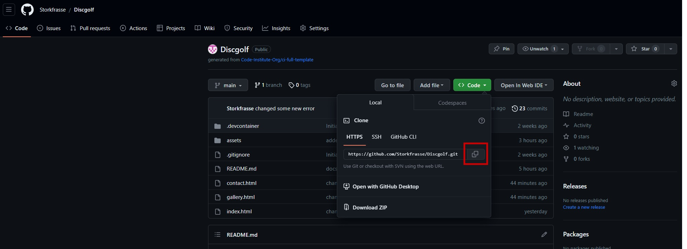
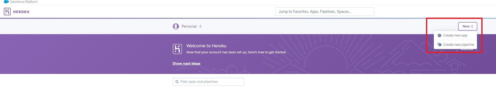
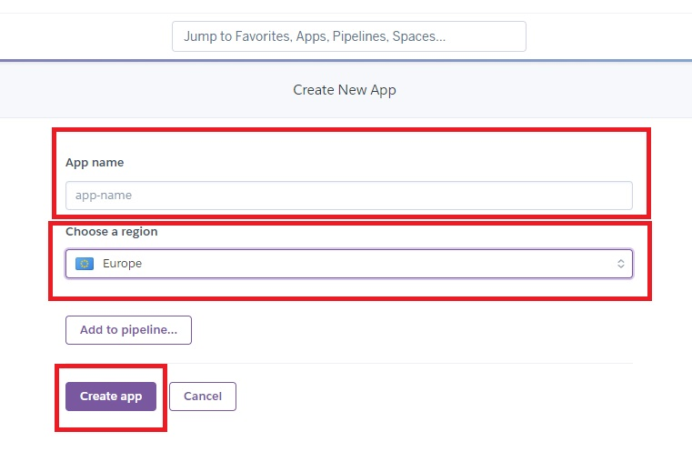
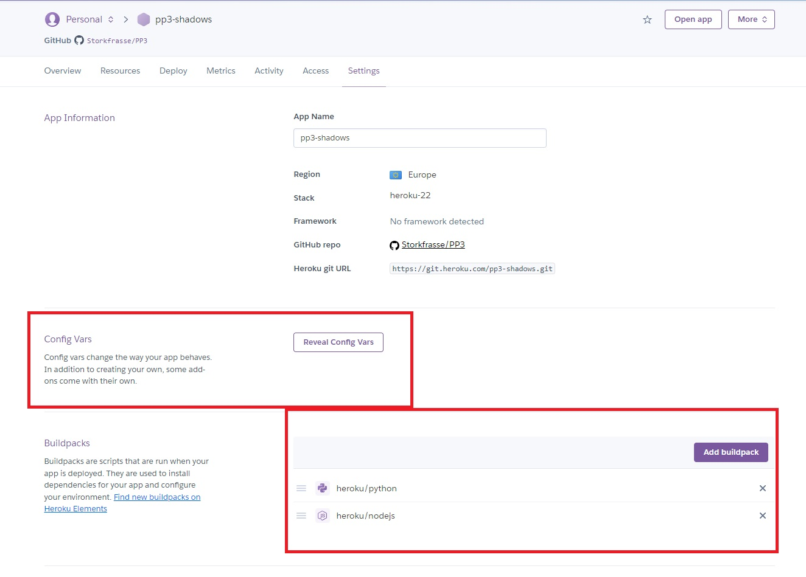
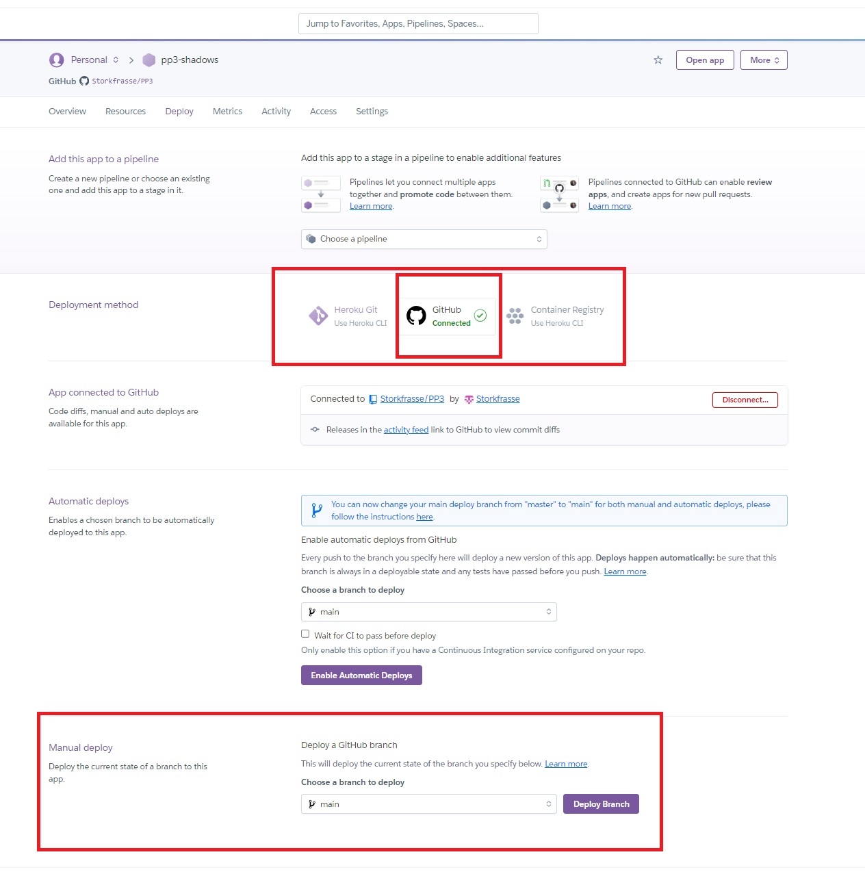

# **Discgolf booking**

Discgolf is my big hobby and i made this site to make a booking system for players. In my hometown there is courses that don't have booking. The site is targeted at the prospective players who is looking for an chance to get a time
on their favourit course.

Welcome to Discgolf booking <a href="https://discgolfpp4-079e1649aec0.herokuapp.com/?fbclid=IwAR1GJfbjm02oFORvi6tbdNfaMUTljSiPQ__apgSMiqFWncl4CHRBNta5CI4" target="_blank" rel="noopener">Discgolf Booking</a>

# Contents

* [**User Experience UX**](<#user-experience-ux>)
    *  [User Stories](<#user-stories>)
    * [Site Structure](<#site-structure>)
    * [Design Choices](<#design-choices>)
    *  [Typography](<#typography>)
* [**Features**](<#features>)
    * [**Home**](<#navigation-menu>)
         * [Navigation menu](<#navigation-menu>)
         * [Register](<#register>)
         * [Footer](<#footer>)
    * [**Future Features**](<#future-features>)
* [**Technologies Used**](<#technologies-used>)
* [**Testing**](<#testing>)
* [**Deployment**](<#deployment>)
* [**Credits**](<#credits>)
    * [**Content**](<#content>)
    * [**Media**](<#media>)
*  [**Acknowledgements**](<#acknowledgements>)

# User Experience

## User Stories

 ### As user I can edit my created booking so that I can change time.

	Acceptance Criteria.
	* Edit a booked time.
	* Only the owner of the time should be able to edit it.

### As user I can delete my booked time.

	Acceptance Criteria.
	* Delete a booked time.
	* Only the owner of the time should be able to delete it.

### As user I can book a time from TimeSlot.

	Acceptance Criteria.
	*Able to book a time.

### As user I can log in and out so that use the site.

	Acceptance Criteria.
	* Able to log in.
	* Able to log out.

### As user I can register an account so that I can use the site.

	Acceptance Criteria.
	* User can choose username.
	* Email is required.
	* A secure password.
	* A confirmation of the users password.

[Back to top](<#contents>)

## Site Structure

Discgolf Booking have several pages. The [home page](header.html) is the main page where you can read a little about the course you will book you time on. There is also a nav menu that are on all of the pages.

[Back to top](<#contents>)
## Design Choices

 * ### Typography
      The fonts chosen were 'Oswald' for the headings and 'Lato' for the body text.  
     *  'Oswald' was chosen for the headings because i thought i was the best as a heading font. it bold and looks good
      * 'Lato' is used for the body text as it provides a nice contrast to the cursive whilst being easy to read for all.

 * ### Color Scheme
      
 
 * ### Idea
      The idea for the site was to make it look like my first project.  

[Back to top](<#contents>)
# Features

I want to make it a part of my first project.

## Existing Features  
  * ### Navigation Menu

    * Sited at the top of all the pages in the site, it is fully responsive and contains links to the pages of the site.
    * The logo is clickable with a link back to the home page for enhanced UX.

[Back to top](<#contents>)

  * ### Register

      * located under the navigation menu.
      * Makes it possible for the a user to register for booking. 

[Back to top](<#contents>)

* ### Footer
    
    * Contains social media links. The links open in other tabs.
    * The link are there for the educational side of this project. They would be fixed with the right information if this site was deployed outside of this project.
    
[Back to top](<#contents>)

* ### Login/Log out

    * located under the navigation menu.
    * Also added java script for automatic logout after 5min inactivity. 

[Back to top](<#contents>)

## Future Features 

* To put it together with pp1.
* To build another pages on the site with the course layout.

[Back to top](<#contents>)

# Technologies Used
* [HTML5](https://html.spec.whatwg.org/) - provides the content and structure for the website.
* [CSS](https://www.w3.org/Style/CSS/Overview.en.html) - provides the styling.
* [JavaScript](https://www.w3schools.com/js/js_intro.asp) - Function like 5min auto logout for example.
* [Python](https://www.python.org/) - Some functions.
* [Django](https://www.djangoproject.com/) - as the python framework.
* [Heroku](https://id.heroku.com/) - To run application.
* [ElephantSQL](https://www.elephantsql.com/) - For the database.
* [Gitpod](https://www.gitpod.io/#get-started) - used to deploy the website.
* [Github](https://github.com/) - used to host and edit the website.

[Back to top](<#contents>)

# Testing

Please refer to [**_here_**](TESTING.md) for the testing results.

[Back to top](<#contents>)

# Deployment

### **To deploy the project**
The site was deployed to GitHub pages. The steps to deploy a site are as follows:
  1. In the GitHub repository, navigate to the **Settings** tab.
  2. Once in Settings, navigate to the **Pages** tab on the left hand side.
  3. Under **Source**, select the branch to **master**, then click **save**.
  4. Once the master branch has been selected, the page will be automatically refreshed with a detailed ribbon display to indicate the successful deployment.

  The live link to the Github repository can be found here - https://github.com/Storkfrasse/Discgolfpp4

### **To fork the repository on GitHub**
A copy of the GitHub Repository can be made by forking the GitHub account. This copy can be viewed and changes can be made to the copy without affecting the original repository. Take the following steps to fork the repository;
1. Log in to **GitHub** and locate the [repository](https://github.com/Storkfrasse/Discgolfpp4).
2. On the right hand side of the page inline with the repository name is a button called **'Fork'**, click on the button to create a copy of the original repository in your GitHub Account.

### **To create a local clone of this project**
The method from cloning a project from GitHub is below:

1. Under the repository’s name, click on the **code** tab.
2. In the **Clone with HTTPS** section, click on the clipboard icon to copy the given URL.

3. In your IDE of choice, open **Git Bash**.
4. Change the current working directory to the location where you want the cloned directory to be made.
5. Type **git clone**, and then paste the URL copied from GitHub.
6. Press **enter** and the local clone will be created.

## (HEROKU DEPLOYMENT)

### **To deploy the project**
The site was deployed to Heroku pages. The steps to deploy a site are as follows:
  1. On the Heroku page, click on **New**, then create a new app.
   
  2. Then a new window will pop up. Create a name for the deployment, and change location (Europe in my case). 
   
  3. Then click **Create app**.
  4. Once it's created, you will be sent to the page for deployment.
  5. In the deployment page, you will go to **Settings**.
  6. Once in Settings, you will need to add Vars (If you need.). Then you need to **Add buildpack** and add Heroku/python and Heroku/nodejs. 
   
  7. Back to deployment. You want to use deployment method **GitHub** and connect to your repository. And search for your project.
  8. At last, you can use manual deploy and click **Deploy Branch**. 
  

  The live link to the Heroku repository can be found here - https://dashboard.heroku.com/apps/discgolfpp4  
  The live link to the GitHub repository can be found here - https://github.com/Storkfrasse/Discgolfpp4

### **To fork the repository on GitHub**
A copy of the GitHub Repository can be made by forking the GitHub account. This copy can be viewed and changes can be made to the copy without affecting the original repository. Take the following steps to fork the repository;
1. Log in to **GitHub** and locate the [repository](https://github.com/Storkfrasse/Discgolfpp4).
2. On the right-hand side of the page in line with the repository name is a button called **'Fork'**, click on the button to create a copy of the original repository in your GitHub Account.

### **To create a local clone of this project**
The method for cloning a project from GitHub is below:

1. Under the repository’s name, click on the **code** tab.
2. In the **Clone with HTTPS** section, click on the clipboard icon to copy the given URL.
1. Go to [Codeanywhere](https://app.codeanywhere.com) Log in with GitHub
2. Press the **+** New Workspace 
3. Paste the link.
4. Press **enter** and the local clone will be created.

[Back to top](#contents)

[Back to top](<#contents>)

# Credits
### Content

* The font came from [Google Fonts](https://fonts.google.com/).
* The icons came from [Font Awesome](https://fontawesome.com/).
* The text in the home pages is from [Google](https://google.com).
* The color scheme is from [Coolors](https://coolors.co/).

### Media
* The photos all came from me and my friends
* The photos were compressed using [iLoveimg](https://www.iloveimg.com/).
* The background picture is from [Google picture search](https://google.com)

[Back to top](<#contents>)

# Acknowledgements
The site was completed as a Portfolio 4 Project piece for the Full Stack Software Developer at the [Code Institute](https://codeinstitute.net/). As such, I would like to thank my mentor [Rory Patrick Sheridan](https://www.linkedin.com/in/rp-sheridan/)

Michael Sjö 2023. 

[Back to top](<#contents>)