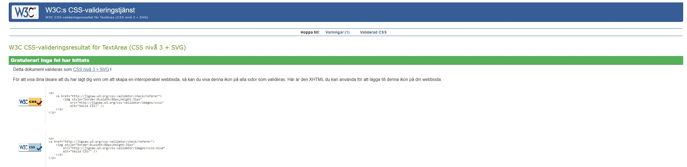
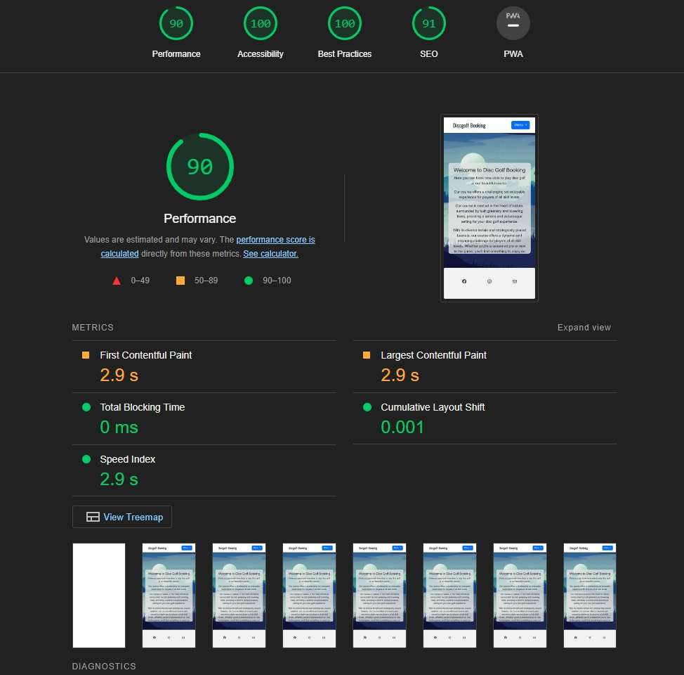

# Testing
## Code Validation
Discgolf Booking website has be tested. All the code has been run through the [W3C CSS Validator](https://jigsaw.w3.org/css-validator/). 

The CSS validator results are below:

## Responsiveness Test

* The responsive design tests were carried out manually with [Google Chrome DevTools](https://developer.chrome.com/docs/devtools/)

|        | Moto G4 | Galaxy S5 | iPhone 5 | iPad | iPad Pro | Display <1200px | Display >1200px |
|--------|---------|-----------|----------|------|----------|-----------------|-----------------|
| Render | pass    | pass      | pass     | pass | pass     | pass            | pass            |
| Images | pass    | pass      | pass     | pass | pass     | pass            | pass            |
| Links  | pass    | pass      | pass     | pass | pass     | pass            | pass            |

## Browser Compatibility

Discgolf booking website was tested on the following browsers.
Google Chrome, Microsoft Edge and Mozilla Firefox. Appearance, functionality and responsiveness were consistent throughout for a range of device sizes and browsers.

## Testing User Stories

* As user I can edit my created booking so that I can change time.
    * Only the user that owns the TimeSlot can change the TimeSlot. 

     
* As user I can delete my booked time.
    * Only the user that owns the TimeSlot can delete it.
    
     
* As user I can book a time from TimeSlot.
    * The User can only book free TimeSlots.

     
* As user I can log in and out so that use the site.
    * The User is able to login and logout.
	
     
* As user I can register an account so that I can use the site.
    * The User can choose a personal username.
	* The User need to fill in email
	* The User need to put in a secure password.
	* The User need to confirm the same password again.

 
## Known Bugs
* ### No known bugs during this project.

    

## Additional Testing

There were minor spelling and grammar errors that have since been fixed.

I did a Light house test with 100% accessibility. 
.

Back to [README.md](./README.md#testing).